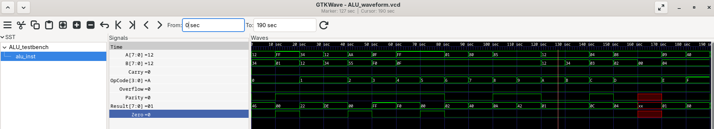

# 🧮 8-bit ALU in Verilog

This project implements an 8-bit Arithmetic Logic Unit (ALU) in Verilog along with a testbench and waveform visualization using GTKWave.

---


## ⚙️ Project Description

The Arithmetic Logic Unit (ALU) is a core component of digital systems responsible for performing arithmetic and logical operations.

This implementation operates on:

* `A` – 8-bit input
* `B` – 8-bit input
* `OpCode` – 4-bit control signal

The ALU produces:

* `Result` – operation output
* status flags: `Carry`, `Zero`, `Overflow`, `Parity`

---

## 🔢 Supported Operations

| OpCode | Operation            |
| ------ | -------------------- |
| 0000   | Addition (A + B)     |
| 0001   | Subtraction (A - B)  |
| 0010   | Bitwise AND          |
| 0011   | Bitwise OR           |
| 0100   | Bitwise XOR          |
| 0101   | Bitwise NOT (A)      |
| 0110   | Shift left           |
| 0111   | Shift right          |
| 1000   | Rotate left          |
| 1001   | Rotate right         |
| 1010   | Equality check       |
| 1011   | Less-than comparison |
| 1100   | Multiplication       |
| 1101   | Division             |
| 1110   | Modulo               |
| 1111   | Conditional shift    |

---

## 🚩 Output Flags

* **Carry** – indicates overflow in addition
* **Zero** – result equals zero
* **Overflow** – arithmetic overflow
* **Parity** – even number of 1s in result

---

## 🖥️ Installation

Install required tools depending on your system:

### Debian / Ubuntu

```bash
sudo apt update
sudo apt install iverilog gtkwave
```

### Fedora

```bash
sudo dnf install iverilog gtkwave
```

### Arch Linux

```bash
sudo pacman -S iverilog gtkwave
```

---

## ▶️ Running the Project

### Compile

```bash
iverilog -o ALU_sim -s ALU_testbench ALU.v ALU_testbench.v
```

### Run simulation

```bash
vvp ALU_sim
```

This generates:

```
ALU_waveform.vcd
```

### Open waveform viewer

```bash
gtkwave ALU_waveform.vcd
```

---

## 📁 Project Structure

```
.
├── ALU.v
├── ALU_testbench.v
├── ALU_sim
├── ALU_waveform.vcd
├── images
│   └── waveform.png
└── README.md
```

---

## 📊 Simulation Results

Below is the waveform generated during simulation:



The waveform presents:

* input signals (`A`, `B`)
* operation selector (`OpCode`)
* computed result (`Result`)
* status flags (`Carry`, `Zero`, `Overflow`, `Parity`)

---

## ⚠️ Notes

* Division by zero produces undefined (`X`) values
* Carry flag is implemented only for addition
* Some edge cases may require further refinement

---

## 🚀 Possible Improvements

* Add division-by-zero protection
* Improve flag handling
* Extend ALU to 16-bit / 32-bit
* Add automated test verification

---

## 👨‍💻 Author

Hubert Jabłoński

